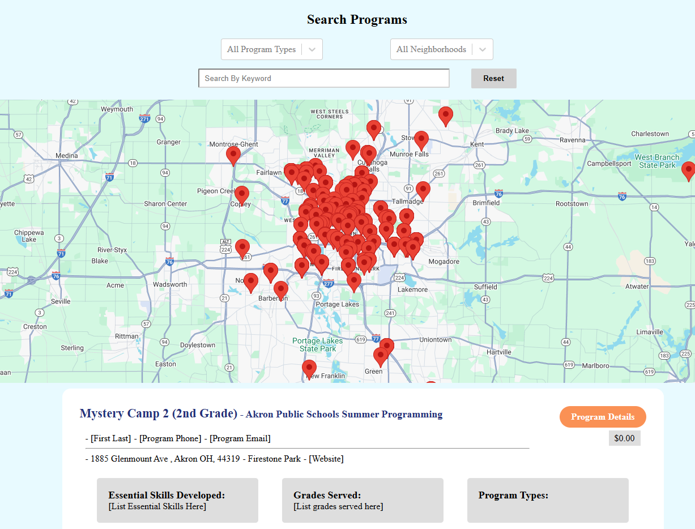

# Program Finder

This program finder is a Demo program finder web application for Out of School programs in Akron, Ohio. It was created leveraging react, google maps API, and AWS cloud services including MySQL RDS, Lambda, and API Gateway. 

Further devlopment is planned, including futher requirement gathering with stakeholders, and data collection from participating partners. 

Here is a screenshot of the map and selection options for program type and neighborhood, along with a program card. 

